# 应用开发

## 插件

### SQL插件

SQLite数据库生成位置：C:\Users\Administrator\AppData\Roaming 目录中的 com.administrator.+项目名称 文件夹中

## 开发知识点

### 移动端左滑退出应用

具体功能：移动端使用左滑返回手势或按物理返回键时只要当前页面在任何一个底部菜单页面时，可以直接将app切换到后台返回桌面（与微信类似）

实现原理：使用路由守卫，只要进入到底部的任何菜单时，历史路由记录中只有一条记录，再次后退时，历史记录清空，从而退出应用

例如，路由历史记录变化过程： 

1. 进入子菜单,["底部菜单1","路由a", "路由b"]
2. 退出子菜单，路由一步步后退，["底部菜单1"]
3. 切换底部菜单，["底部菜单2"]
4. 再次后退，[]

实现代码，App.vue中：

~~~javascript
mport { useRouter } from 'vue-router';
const router = useRouter()
let isRedirecting = false // 是否重定
// 路由守卫
router.beforeEach((to) => {
  const menuRoutes = ['/home', '/statistics', '/user'] // 底部菜单路由
  // 如果要进入的路由在菜单路由中，并且没有重定向
  if (menuRoutes.includes(to.path) && !isRedirecting) {
    isRedirecting = true
    return { ...to, replace: true } // 重定向到要进入的路由，并且使用替换模式，替换历史路由记录中的上一条记录
  } else {
    isRedirecting = false
    return true
  }
})
~~~

### 读取本地文件

不管是移动端还是桌面端，打开弹窗选择文件时，尽量使用原生的 <input type="file"/> 标签。不要使用dialog插件。

原生input选择文件的方法：

~~~vue
<template>
<input type="file" accept=".xlsx" @change="readFile" ref="select-excel-input" style="display: none;">
</template>
<script setup>
    import { useTemplateRef } from "vue"
    const selectExcelInput = useTemplateRef('select-excel-input') // 文件选择input框
    // 打开文件选择器
    function openFileDialog() {
        selectExcelInput.value.clock()
    }
    // 读取文件内容
    async function readFile(event) {
        const file = event.target.files[0] // 获取文件对象
    	if (!file) return // 如果没有选择文件，则直接退出
        try {
             const buffer = await file.arrayBuffer(); // 读取文件对象全部内容
        	const bytes = new Uint8Array(buffer) // 将文件内容转换为二进制字节数组
        	const bytesArr = Array.from(bytes) // 将二进制字节数组转换为普通数组
            // 后端解析数据
            const records = await invoke("read_excel",{bytes: bytesArr}) 
            // 也可以前端解析
        }
        catch (error) {
            // 报错处理
        }
    }
</script>
~~~

dialog插件的问题：

+ 可能会出现的现象：当多次选择完文件且无反应后，下一次选择完有反应后，会执行之前几次未执行的代码。
+ 原因：它在移动端会出现选择完文件后文件选择器关闭后，有时WebView 并未立刻回到前台（JS 线程仍在挂起），导致前端无反应，JS 事件循环暂停，`await` 后面的微任务可能被延迟到下次回到前台时才执行，但有时甚至更糟，回调直接丢失。

### rust读取excel表格数据

前端传递xlsx文件的二进制数据，后端解析数据，获取第一个工作表中的数据，并返回为二维数组传递给前端

rust需要添加 calamine 包

lib.rs

~~~rust
// Learn more about Tauri commands at https://tauri.app/develop/calling-rust/
// 读取 Excel
use calamine::{open_workbook_from_rs, Reader, Xlsx};
use std::io::Cursor;
#[tauri::command]
fn read_excel(bytes: Vec<u8>) -> Result<Vec<Vec<String>>, String> {
    // 1. 将前段传递过来的字节转换为Excel
    let cursor = Cursor::new(bytes);
    let mut workbook: Xlsx<_> =
        open_workbook_from_rs(cursor).map_err(|e| format!("解析 Excel 失败: {}", e))?;

    // 2. 获取第一个工作表名称
    let sheet_names = workbook.sheet_names();
    if sheet_names.is_empty() {
        return Err("Excel 文件中没有工作表".to_string());
    }
    let sheet_name = &sheet_names[0];

    // 3. 读取工作表：这里直接匹配 Ok(range)，因为返回的是 Result<Range, XlsxError>
    let sheet = match workbook.worksheet_range(sheet_name) {
        Ok(range) => range,
        Err(e) => return Err(format!("读取工作表失败: {}", e)),
    };

    // 4. 将表格数据转为 Vec<Vec<String>>
    let mut result = Vec::new();
    for row in sheet.rows() {
        // 只取前4列，不足用空字符串补齐，多余忽略
        let row_str: Vec<String> = (0..6)
            .map(|i| {
                row.get(i)
                    .map(|cell| cell.to_string())
                    .unwrap_or_default()
            })
            .collect();
        result.push(row_str);
    }
    Ok(result)
}
~~~

### 保存excel表格

不建议使用dialog插件文件对话框保存，可能会出现与读取本地文件时一样的问题，保存完后无法应

解决方法：前端使用公共固定路径保存

default.json权限配置：

~~~json
{
  "$schema": "../gen/schemas/desktop-schema.json",
  "identifier": "default",
  "description": "Capability for the main window",
  "windows": [
    "main"
  ],
  "permissions": [
    "core:default",
    "opener:default",
    "sql:default",
    "sql:allow-execute",
      // 添加以下权限
    "fs:default",
    {
      "identifier": "fs:allow-write-file",
      "allow": [
        {
          "path": "/storage/emulated/0/Download/**" // 保存位置，Download表示保存到公共下载文件夹中，也可以手动更改位置
        }
      ]
    }
  ]
}
~~~

AndroidManifest.xml配置：

~~~xml
<?xml version="1.0" encoding="utf-8"?>
<manifest xmlns:android="http://schemas.android.com/apk/res/android">
    <uses-permission android:name="android.permission.INTERNET" />
    <!-- 添加以下两个权限 -->
    <uses-permission android:name="android.permission.READ_EXTERNAL_STORAGE"/>
    <uses-permission android:name="android.permission.WRITE_EXTERNAL_STORAGE" />

    <!-- AndroidTV support -->
    <uses-feature android:name="android.software.leanback" android:required="false" />

    <application
        // 添加以下一个配置，针对 Android 10+ 兼容
        android:requestLegacyExternalStorage="true"
                 
        android:icon="@mipmap/ic_launcher"
        android:label="@string/app_name"
        android:theme="@style/Theme.health4"
        android:usesCleartextTraffic="${usesCleartextTraffic}">
        <activity
            android:configChanges="orientation|keyboardHidden|keyboard|screenSize|locale|smallestScreenSize|screenLayout|uiMode"
            android:launchMode="singleTask"
            android:label="@string/main_activity_title"
            android:name=".MainActivity"
            android:exported="true">
            <intent-filter>
                <action android:name="android.intent.action.MAIN" />
                <category android:name="android.intent.category.LAUNCHER" />
                <!-- AndroidTV support -->
                <category android:name="android.intent.category.LEANBACK_LAUNCHER" />
            </intent-filter>
        </activity>

        <provider
          android:name="androidx.core.content.FileProvider"
          android:authorities="${applicationId}.fileprovider"
          android:exported="false"
          android:grantUriPermissions="true">
          <meta-data
            android:name="android.support.FILE_PROVIDER_PATHS"
            android:resource="@xml/file_paths" />
        </provider>
    </application>
</manifest>

~~~

前端传递表格数据，后端生成xlsx文件对象，plugin-fs插件保存文件

~~~javascript
import { writeFile } from '@tauri-apps/plugin-fs'
import { invoke } from "@tauri-apps/api/core"
async function exportData() {
    try {
        // 整理血压记录为数组格式，便于rust处理

        // 调用 Rust 生成 Excel 字节
        const result = await invoke('create_excel', { data: tableData })
        const fileData = new Uint8Array(result.data)

        // 生成文件名（带时间戳）
        const fileName = `血压记录_${formatDateTime2(new Date())}.xlsx`

        //入文件到下载目录中
        const downloadPath = '/storage/emulated/0/Download' // 此处路径必须与default.json中配置公共路径一样
        const fullPath = `${downloadPath}/${fileName}`
        await writeFile(fullPath, fileData)
		
        console.log("保存成功")
    }catch (e) {
      console.log("保存失败")
    }
}
~~~

后端生成excel文件对象，需添加rust_xlsxwriter包，lib.rs

~~~rust
// 生成 Excel
use rust_xlsxwriter::Workbook;
use serde::Serialize;
#[derive(Serialize)]
struct ExcelData {
    data: Vec<u8>, // 直接返回字节
}
#[tauri::command]
fn create_excel(data: Vec<Vec<String>>) -> Result<ExcelData, String> {
    let buffer = (|| {
        let mut workbook = Workbook::new();
        let worksheet = workbook.add_worksheet().set_name("血压记录")?;
        worksheet.write_row_matrix(0, 0, data)?;
        workbook.save_to_buffer()
    })()
        .map_err(|e| e.to_string())?;
    Ok(ExcelData { data: buffer })
}
~~~

### 移动端输入框被键盘遮挡

原因：tauri2移动端应用默认使用的是全屏模式并且键盘弹出模式为遮盖

#### 解决方案1

屏幕状态：应用模式为全屏状态

优点：配置复杂

缺点：无

解决方案

1.设置键盘模式为adjustResize，弹出时压缩窗口大小，让应用界面重新布局以显示输入框。在src-tauri\gen\android\app\src\main\AndroidManifest.xml中配置，如下：

```xml
<?xml version="1.0" encoding="utf-8"?>
<manifest xmlns:android="http://schemas.android.com/apk/res/android">
    <uses-permission android:name="android.permission.INTERNET" />
    <uses-permission android:name="android.permission.READ_EXTERNAL_STORAGE"/>
    <uses-permission android:name="android.permission.WRITE_EXTERNAL_STORAGE" />

    <!-- AndroidTV support -->
    <uses-feature android:name="android.software.leanback" android:required="false" />

    <application
        android:requestLegacyExternalStorage="true"
        android:icon="@mipmap/ic_launcher"
        android:label="@string/app_name"
        android:theme="@style/Theme.health4"
        android:usesCleartextTraffic="${usesCleartextTraffic}">
        <!-- 在activity中添加 android:windowSoftInputMode="adjustResize" -->
        <activity
            android:configChanges="orientation|keyboardHidden|keyboard|screenSize|locale|smallestScreenSize|screenLayout|uiMode"
            android:launchMode="singleTask"
            android:label="@string/main_activity_title"
            android:name=".MainActivity"
            android:exported="true"
            android:windowSoftInputMode="adjustResize">
            <intent-filter>
                <action android:name="android.intent.action.MAIN" />
                <category android:name="android.intent.category.LAUNCHER" />
                <!-- AndroidTV support -->
                <category android:name="android.intent.category.LEANBACK_LAUNCHER" />
            </intent-filter>
        </activity>

        <provider
          android:name="androidx.core.content.FileProvider"
          android:authorities="${applicationId}.fileprovider"
          android:exported="false"
          android:grantUriPermissions="true">
          <meta-data
            android:name="android.support.FILE_PROVIDER_PATHS"
            android:resource="@xml/file_paths" />
        </provider>
    </application>
</manifest>

```

2.在src-tauri\gen\android\app\src\main\java\com\administrator文件夹中新建AndroidBug5497Workaround.java文件，创建AndroidBug5497Workaround类，解决安卓5479bug：

~~~java
package com.administrator.health4; // 声明包名为自己项目的名称，在MainActivity.kt中的第一行中可以找到

import android.app.Activity;
import android.graphics.Rect;
import android.view.View;
import android.view.ViewGroup;
import android.view.ViewTreeObserver;
import android.widget.FrameLayout;

public class AndroidBug5497Workaround {

    public static void assistActivity(Activity activity) {
        new AndroidBug5497Workaround(activity);
    }

    private View mChildOfContent;
    private int usableHeightPrevious;
    private FrameLayout.LayoutParams frameLayoutParams;
    private final FrameLayout content;
    private ViewTreeObserver.OnGlobalLayoutListener layoutListener;

    private AndroidBug5497Workaround(Activity activity) {
        content = (FrameLayout) activity.findViewById(android.R.id.content);
        // 检查是否已有子视图
        if (content.getChildCount() > 0) {
            initChild(content.getChildAt(0));
        } else {
            // 没有子视图，等待布局变化
            layoutListener = new ViewTreeObserver.OnGlobalLayoutListener() {
                @Override
                public void onGlobalLayout() {
                    if (content.getChildCount() > 0) {
                        content.getViewTreeObserver().removeOnGlobalLayoutListener(this);
                        initChild(content.getChildAt(0));
                    }
                }
            };
            content.getViewTreeObserver().addOnGlobalLayoutListener(layoutListener);
        }
    }

    private void initChild(View child) {
        mChildOfContent = child;
        frameLayoutParams = (FrameLayout.LayoutParams) mChildOfContent.getLayoutParams();
        mChildOfContent.getViewTreeObserver()
                .addOnGlobalLayoutListener(new ViewTreeObserver.OnGlobalLayoutListener() {
                    public void onGlobalLayout() {
                        possiblyResizeChildOfContent();
                    }
                });
        // 如果之前等待布局时已经错过了一次测量，主动调用一次
        possiblyResizeChildOfContent();
    }

    private void possiblyResizeChildOfContent() {
        if (mChildOfContent == null) return;
        int usableHeightNow = computeUsableHeight();
        if (usableHeightNow != usableHeightPrevious) {
            int usableHeightSansKeyboard = mChildOfContent.getRootView().getHeight();
            int heightDifference = usableHeightSansKeyboard - usableHeightNow;
            if (heightDifference > (usableHeightSansKeyboard / 4)) {
                // 键盘弹出
                frameLayoutParams.height = usableHeightSansKeyboard - heightDifference;
            } else {
                // 键盘收起
                frameLayoutParams.height = usableHeightSansKeyboard;
            }
            mChildOfContent.requestLayout();
            usableHeightPrevious = usableHeightNow;
        }
    }

    private int computeUsableHeight() {
        Rect r = new Rect();
        mChildOfContent.getWindowVisibleDisplayFrame(r);
        return (r.bottom - r.top);
    }
}
~~~

3.在src-tauri\gen\android\app\src\main\java\com\administrator\health4\MainActivity.kt中启用：

~~~kotlin
package com.administrator.health4

import android.os.Bundle
import androidx.activity.enableEdgeToEdge

class MainActivity : TauriActivity() {
  override fun onCreate(savedInstanceState: Bundle?) {
    enableEdgeToEdge() // 全屏模式
    super.onCreate(savedInstanceState)
    AndroidBug5497Workaround.assistActivity(this) // // 在此处位置添加启用
  }
}

~~~

#### 解决方案2

屏幕状态：非全屏状态，页面将从状态栏下面开始绘制

优点：配置简单

缺点：需要配置状态栏颜色，否则将使用系统默认颜色，背景紫色、字体\图标白色。

解决方案：

1.设置键盘模式为adjustResize，弹出时压缩窗口大小，让应用界面重新布局以显示输入框。在src-tauri\gen\android\app\src\main\AndroidManifest.xml中配置，如下：

~~~xml
<?xml version="1.0" encoding="utf-8"?>
<manifest xmlns:android="http://schemas.android.com/apk/res/android">
    <uses-permission android:name="android.permission.INTERNET" />
    <uses-permission android:name="android.permission.READ_EXTERNAL_STORAGE"/>
    <uses-permission android:name="android.permission.WRITE_EXTERNAL_STORAGE" />

    <!-- AndroidTV support -->
    <uses-feature android:name="android.software.leanback" android:required="false" />

    <application
        android:requestLegacyExternalStorage="true"
        android:icon="@mipmap/ic_launcher"
        android:label="@string/app_name"
        android:theme="@style/Theme.health4"
        android:usesCleartextTraffic="${usesCleartextTraffic}">
        <!-- 在activity中添加 android:windowSoftInputMode="adjustResize" -->
        <activity
            android:configChanges="orientation|keyboardHidden|keyboard|screenSize|locale|smallestScreenSize|screenLayout|uiMode"
            android:launchMode="singleTask"
            android:label="@string/main_activity_title"
            android:name=".MainActivity"
            android:exported="true"
            android:windowSoftInputMode="adjustResize">
            <intent-filter>
                <action android:name="android.intent.action.MAIN" />
                <category android:name="android.intent.category.LAUNCHER" />
                <!-- AndroidTV support -->
                <category android:name="android.intent.category.LEANBACK_LAUNCHER" />
            </intent-filter>
        </activity>

        <provider
          android:name="androidx.core.content.FileProvider"
          android:authorities="${applicationId}.fileprovider"
          android:exported="false"
          android:grantUriPermissions="true">
          <meta-data
            android:name="android.support.FILE_PROVIDER_PATHS"
            android:resource="@xml/file_paths" />
        </provider>
    </application>
</manifest>

~~~

2.取消全屏模式enableEdgeToEdge()，在src-tauri\gen\android\app\src\main\java\com\administrator\health4\MainActivity.kt中配置：

~~~kotlin
package com.administrator.health4

import android.os.Bundle
// import androidx.activity.enableEdgeToEdge

class MainActivity : TauriActivity() {
  override fun onCreate(savedInstanceState: Bundle?) {
      // 注释或删除全屏设置
    // enableEdgeToEdge()
    super.onCreate(savedInstanceState)
  }
}
~~~

3.额外配置，有些版本的系统可能需要在MainActivity.kt中额外配置键盘模式为压缩窗口大小：

~~~kotlin
package com.administrator.health4

import android.os.Bundle
// 注意导入
import android.view.WindowManager 

class MainActivity : TauriActivity() {
  override fun onCreate(savedInstanceState: Bundle?) {
    // 在此处添加
    window.setSoftInputMode(WindowManager.LayoutParams.SOFT_INPUT_ADJUST_RESIZE)
    super.onCreate(savedInstanceState)
  }
}

~~~

### 发送通知

使用 @choochmeque/tauri-plugin-notifications-api 插件可以实现通知，不建议使用官方的notification插件，除了文档案例少的可怜外，还不支持取消通知

插件github网址：https://github.com/Choochmeque/tauri-plugin-notifications#readme

本教程是Android平台的，其它平台的可以参考github上的教程

操作步骤：

1.安装前端依赖：

~~~cmd
npm install @choochmeque/tauri-plugin-notifications-api
~~~

2.安装rust端依赖：

~~~cmd
cargo add tauri-plugin-notifications
~~~

或者手动在Cargo.toml中添加:

~~~toml
[dependencies]
tauri-plugin-notifications = "0.4" # 按照最新版本来
~~~

3.src-tauri\src\lib.rs中注册插件：

~~~rust
#[cfg_attr(mobile, tauri::mobile_entry_point)]
pub fn run() {
    tauri::Builder::default()
        .plugin(tauri_plugin_notifications::init()) // 在此处配置
        .plugin(tauri_plugin_fs::init())
        .plugin(tauri_plugin_sql::Builder::new().build())
        .plugin(tauri_plugin_opener::init())
        .invoke_handler(tauri::generate_handler![greet, create_excel, read_excel]) // 合并为一个
        .run(tauri::generate_context!())
        .expect("error while running tauri application");
}
~~~

4.添加通知权限，rc-tauri\capabilities\default.json:

~~~json
"permissions": [
    "notifications:default"
  ]
~~~

5.src-tauri\gen\android\app\src\main\AndroidManifest.xml中添加`精确闹钟`权限，用于防止因为系统省电而造成的通知延迟，从Android12开始，这个权限在应用中默认是关闭的，需要申请。

~~~xml
<?xml version="1.0" encoding="utf-8"?>
<manifest xmlns:android="http://schemas.android.com/apk/res/android">
    <uses-permission android:name="android.permission.INTERNET" />
    <!-- 通知权限 -->
    <uses-permission android:name="android.permission.READ_EXTERNAL_STORAGE"/>
    <uses-permission android:name="android.permission.WRITE_EXTERNAL_STORAGE" />

    <!-- AndroidTV support -->
    <uses-feature android:name="android.software.leanback" android:required="false" />
    <!-- 在这添加精准闹钟权限 -->
    <uses-permission android:name="android.permission.SCHEDULE_EXACT_ALARM" />

    <application
        android:requestLegacyExternalStorage="true"
        android:icon="@mipmap/ic_launcher"
        android:label="@string/app_name"
        android:theme="@style/Theme.health4"
        android:usesCleartextTraffic="${usesCleartextTraffic}">
        <!-- 在activity中添加 android:windowSoftInputMode="adjustResize" -->
        <activity
            android:configChanges="orientation|keyboardHidden|keyboard|screenSize|locale|smallestScreenSize|screenLayout|uiMode"
            android:launchMode="singleTask"
            android:label="@string/main_activity_title"
            android:name=".MainActivity"
            android:exported="true"
            android:windowSoftInputMode="adjustResize">
            <intent-filter>
                <action android:name="android.intent.action.MAIN" />
                <category android:name="android.intent.category.LAUNCHER" />
                <!-- AndroidTV support -->
                <category android:name="android.intent.category.LEANBACK_LAUNCHER" />
            </intent-filter>
        </activity>

        <provider
          android:name="androidx.core.content.FileProvider"
          android:authorities="${applicationId}.fileprovider"
          android:exported="false"
          android:grantUriPermissions="true">
          <meta-data
            android:name="android.support.FILE_PROVIDER_PATHS"
            android:resource="@xml/file_paths" />
        </provider>
    </application>
</manifest>

~~~

6.添加自定义通知声音时，在src-tauri\gen\android\app\src\main\res文件中创建文件夹raw，并将音频文件添加到此文件夹中。

注意：

1. 音频格式我只测试了wav格式，询问ai，说是支持的格式有 mp3、wav、ogg、m4a等
2. 音频文件不能太大，音频文件命必须以字母开头，且只能包含字母、数字和下划线，字母只能小写

6.添加自定义通知图标时，在src-tauri\gen\android\app\src\main\res\drawable文件中添加图标文件，支持的格式我只知道有png，且文件命必须以字母开头，且只能包含字母、数字和下划线，字母只能小写

6.前端发送通知：

~~~javascript
import {
  cancel, sendNotification, cancelAll, isPermissionGranted, requestPermission, createChannel,
  Importance,Visibility,removeChannel,channels
} from '@choochmeque/tauri-plugin-notifications-api'

// 发送通知详细操作
// 检查并请求通知权限，只需执行一次
let permissionGranted = await isPermissionGranted()
if (!permissionGranted) {
  const permission = await requestPermission()
  permissionGranted = permission === 'granted'
}
// 创建通知渠道（主要用于自定义的通知声音）
await createChannel({
    id: '1', // 渠道id
    name: '服药提醒', // 渠道名称
    description: '服药提醒', // 渠道描述
    importance: Importance.High, // 高重要性确保声音能播放
    visibility: Visibility.Public, // 锁屏时显示通知的‌完整内容‌（标题+正文）
    sound: 'notice_1' // 自定义的提示声音文件名
})
// 发送通知
await sendNotification({
    channelId: channelId, //选填 通知渠道id
    id: id, //选填 通知id，正整数类型，用于管理通知
    title: title, //必填 通知标题
    largeBody: largeBody, //必填 通知内容，多行文本，如果使用body属性展示通知内容，有时会显示不全
    icon: 'tz', //选填 通知图标，默认值message_icon，可以使用自定义的图标，只需填写文件名
    autoCancel: true, // 选填 点击通知，通知消失
    schedule: { 
        at: {
            date: noticeTimeDate.toISOString(), // 触发时间
            repeat: false, // 不重复触发通知
        	allowWhileIdle: true // 省电模式下也能触发通知
        } 
    } //选填 定时通知或重复通知，此处为定时通知
})
// 取消指定通知
await cancel([1,2]) // 数组中的是通知id，可以传入多个
// 清空本应用的通知
await cancelAll()
// 获取所有通知渠道
await channels()
// 删除指定通知渠道
 await removeChannel(通知渠道id)
~~~

具体通知的参数配置，查看github中的文档

问题，在Android8.0（API 26）及以上：

1. 通知渠道一旦创建，其设置的（声音、震动、重要性等）就会"锁定"，由系统管理，应用无法通过再次调用creatChannel来修改
2. 当通过remove(id)删除渠道后，如果再用相同的id创建新渠道，Adnroid会恢复删除渠道的旧配置（"resurect"机制），而不是应用新配置

解决方法：

+ 让渠道id与声音绑定，不同的提示音用不同的渠道id，这样新的声音就会创建一个全新的渠道

注意：

1. 如果通知时没有提示音，可能需要在该应用的通知权限中开启`铃声选项`
2. 如果需要锁屏时也显示通知（屏幕没有熄灭），则需要在该应用的通知权限中开启`锁屏通知`
3. 如果需要横幅通知，则需要在该应用的通知权限中开启`横幅通知`
4. 如果需要在应用切换到后台时还能显示通知，则需要在该应用的耗电管理中开启`允许完全后台行为`
5. 如果需要该应用在息屏状态下时还能点亮屏幕（屏幕点亮后还是锁屏状态）显示通知，则需要在该应用的耗电管理中开启`允许完全后台行为`，在系统的锁屏通知菜单中，开启`锁屏来通知时亮屏`，在 `电池`设置中找到`耗电优化`，关闭该应用的耗电优化
6. Android的资源文件名（如res/raw下的文件）只能包含小写字母a-z、数字0-9和下划线
7. await channels()获取所有渠道时，如果有渠道没有sound，则获取时会报错

### 电池优化

基本上没什么用，手动在手机的电池选项中把该应用异常耗电优化关闭就可以了，要不然就算使用了插件关闭了电池优化，手机中的耗电优化还开着通知照样延迟或不通知

问题：在Android系统中，应用默认开启了电池优化，导致在息屏状态下，通知或后台任务（不包括js或rust代码）延时或不执行。

解决方案：使用`tauri-plugin-android-battery-optimization`插件。

插件地址：https://github.com/NeoHuncho/tauri-plugin-android-battery-optimization

安装使用方法：

1.rust端安装依赖：

~~~cmd
cargo add tauri-plugin-android-battery-optimization
~~~

2.前端安装依赖：

~~~cmd
pnpm add tauri-plugin-android-battery-optimization-api
# or
npm install tauri-plugin-android-battery-optimization-api
# or
yarn add tauri-plugin-android-battery-optimization-api
~~~

3.注册插件，src-tauri/src/lib.rs：

~~~rust
pub fn run() {
    tauri::Builder::default()
        .plugin(tauri_plugin_android_battery_optimization::init())
        .run(tauri::generate_context!())
        .expect("error while running tauri application");
}
~~~

4.添加权限，src-tauri/capabilities/default.json：

~~~json
{
  "permissions": ["android-battery-optimization:default"]
}
~~~

5.js中使用：

~~~javascript
import {
  checkBatteryOptimizationStatus,
  requestBatteryOptimizationExemption,
  openBatterySettings,
} from 'tauri-plugin-android-battery-optimization-api'

// 检查电池优化状态
const status = await checkBatteryOptimizationStatus()
// 以下两个状态互斥
status.isOptimized // 返回布尔值，true：未开启电池优化，false：开启了电池优化
status.isIgnoringOptimizations // 返回布尔值，true：开启了电池优化，false：未开启电池优化

// 弹出申请电池优化弹窗，只有在未开启电池优化时才能弹出
await requestBatteryOptimizationExemption()
// 打开所有已开启了电池优化应用的页面，只有开启了电池优化的应用才能在此页面显示
await openBatterySettings();​
~~~

## 本地资源加载

问题：有时前端的资源文件（如字体、图标、图片）会出现无法加载的情况，或本地文件路径转url后无法加载

解决方法，`src-tauri\tauri.conf.json`中的`"security"`修改为如下内容：

~~~json
"security": {
      "csp": "default-src 'self'; img-src 'self' asset: http://asset.localhost data: blob:; font-src 'self' asset: http://asset.localhost data:; style-src 'self' 'unsafe-inline'",
      "assetProtocol": {
        "enable": true,
        "scope": {
          "requireLiteralLeadingDot": false,
          "allow": [
            "$CACHE/**",
            "$APPLOCALDATA/**",
            "$APPDATA/**"
          ],
          "deny": []
        }
      }
    }
~~~

## 前置条件

### 安装Rust

### 安装NodeJs

### 安装Android Studio

Android Studio官网：https://developer.android.google.cn/studio?hl=zh-cn

使用 Android Studio 中的 SDK 管理器安装以下内容：

- Android SDK Platform
- Android SDK Platform-Tools
- NDK (Side by side)
- Android SDK Build-Tools
- Android SDK Command-line Tools

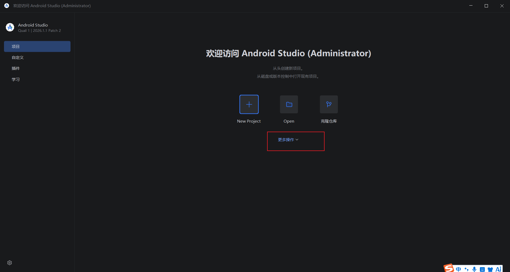

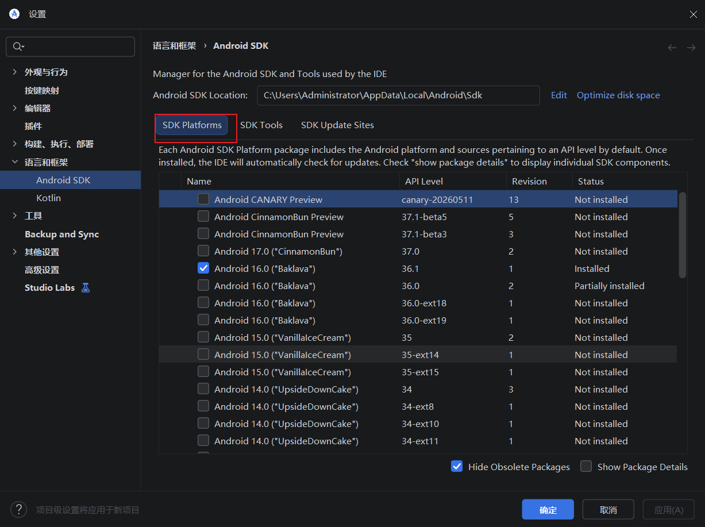

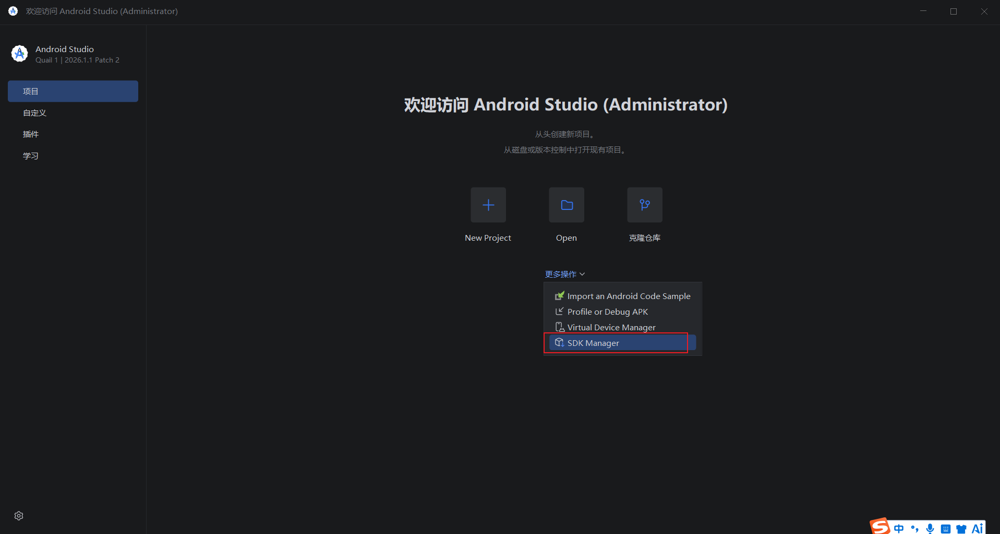

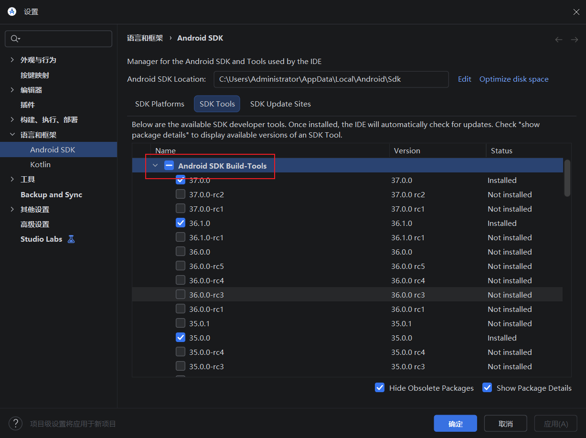

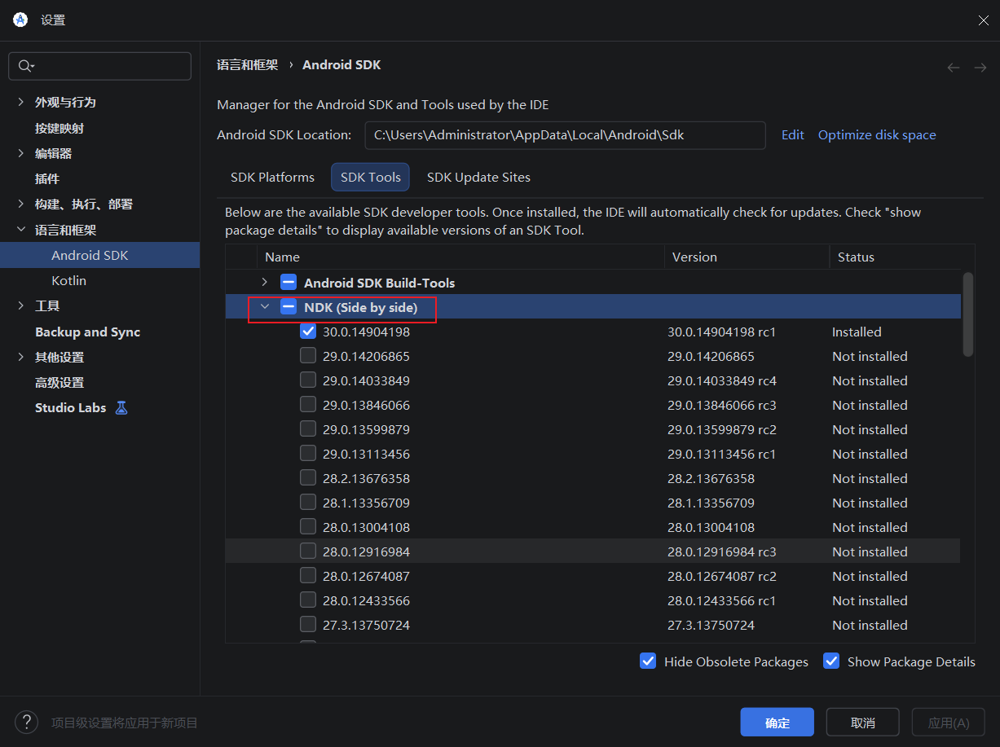

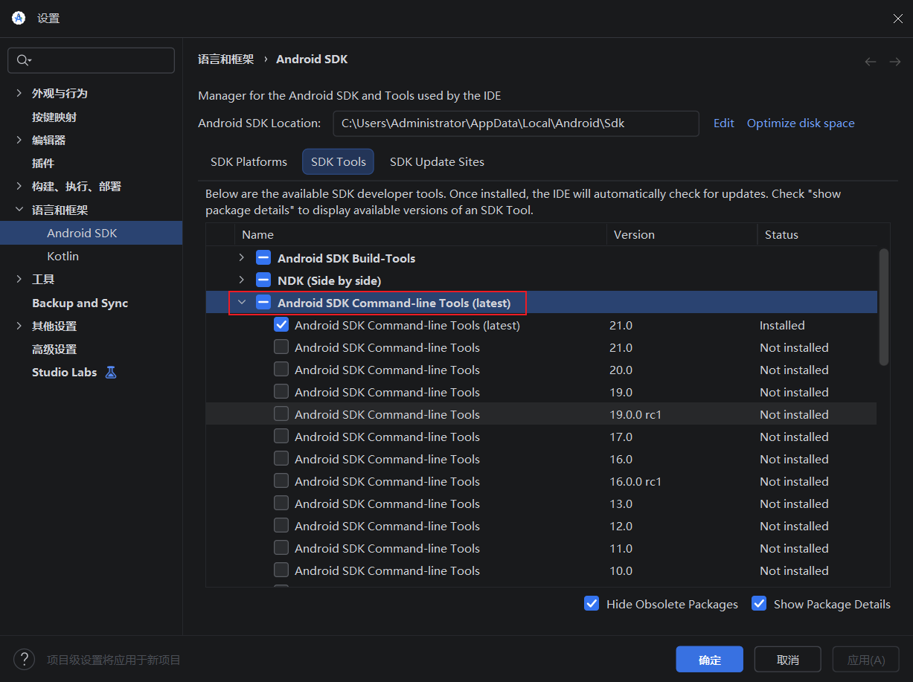

注意：Android Studio安装位置和SDK的位置安装时可以手动选择，以上目录是默认的

### 配置环境变量

以下命令均在PowerShell中执行：

+ JAVA_HOME：

~~~pow
[System.Environment]::SetEnvironmentVariable("JAVA_HOME", "C:\Program Files\Android\Android Studio\jbr", "User")
~~~

+ ANDROID_HOME：

~~~po
[System.Environment]::SetEnvironmentVariable("ANDROID_HOME", "$env:LocalAppData\Android\Sdk", "User")
~~~

+ NDK_HOME:

~~~pow
$VERSION = Get-ChildItem -Name "$env:LocalAppData\Android\Sdk\ndk" | Select-Object -Last 1
[System.Environment]::SetEnvironmentVariable("NDK_HOME", "$env:LocalAppData\Android\Sdk\ndk\$VERSION", "User")
~~~

环境变量具体路径可以根据Android Studio和SDK的实际路径配置

以下是执行了上述命令后自动配置的环境变量：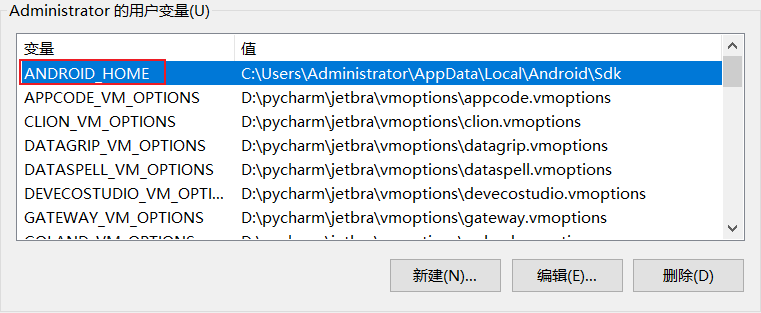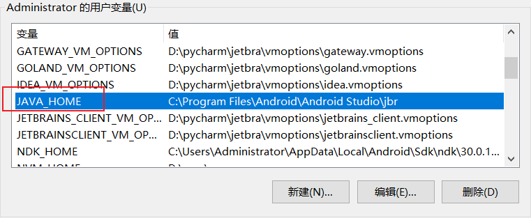

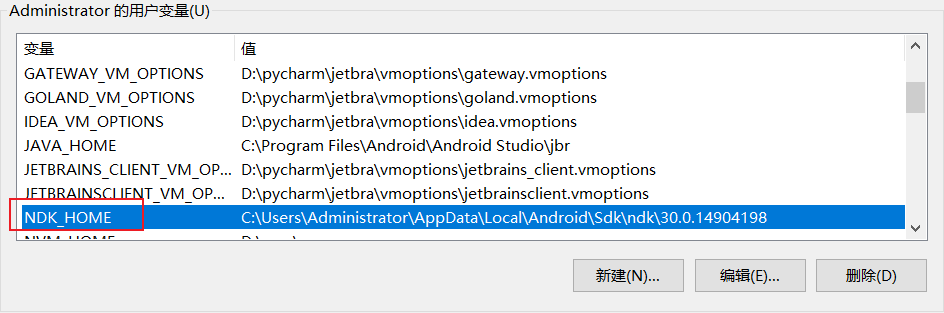

### 为Rust添加安卓编译目标

~~~cmd
rustup target add aarch64-linux-android armv7-linux-androideabi i686-linux-android x86_64-linux-android
~~~

## 创建项目

创建项目命令，按照提示选择即可：

~~~cmd
npm create tauri-app@latest
pnpm create tauri-app
~~~

初始化项目，在项目根目录内执行命令：

~~~cmd
npm install
npm run tauri android init
~~~

注意：项目路径中不能出现中文，否则打包时会报错

## 打包app

### **更新应用图标**（可选）

将你的应用图标（如 `app-icon.png`）放在项目根目录，然后运行：

~~~cmd
tauri icon
~~~

Tauri 会自动生成所有平台所需的图标尺寸

### 设置应用名称（可选）

打开src-tauri/gen/android/app/src/main/res/values/strings.xml文件，修改app_name与main_activity_title标签中的名称为应用名称，：

~~~xml
<resources>
    <string name="app_name">"血压记录"</string>
    <string name="main_activity_title">"血压记录"</string>
</resources>
~~~

### **调整应用版本和配置**（可选）

- 应用版本号在 `tauri.conf.json` 文件中的 `version` 字段定义。
- 安卓的 `versionCode` 默认由 `version` 自动生成（`主版本号*1000000 + 次版本号*1000 + 修订号`）。你也可以在 `tauri.conf.json` 的 `bundle > android > versionCode` 中自定义。
- Tauri 应用最低支持 **Android 7.0 (SDK 24)**。你可以在 `tauri.conf.json` 的 `bundle > android > minSdkVersion` 中修改

### 修改状态栏主题颜色（可选）

在非全屏状态下，状态栏颜色会变为系统默认颜色，背景紫色、字体\图标白色。

在`src-tauri\gen\android\app\src\main\res\values\themes.xml`：

~~~xml
<resources xmlns:tools="http://schemas.android.com/tools">
    <!-- Base application theme. -->
    <style name="Theme.health_butler" parent="Theme.MaterialComponents.DayNight.NoActionBar">
        <!-- Customize your theme here. -->
        
        <!-- 状态栏颜色，引用colors.xml中的颜色 -->
        <item name="android:statusBarColor">@android:color/white</item>
        <!-- 状态栏文字/图标为黑色（API 23+） -->
        <item name="android:windowLightStatusBar">true</item>
    </style>
</resources>
~~~

状态栏问题/图标颜色 可选值：

+ 浅色（根据系统颜色而定，默认白色）：<item name="android:windowLightStatusBar">false</item>
+ 深色（根据系统颜色而定，默认黑色）：<item name="android:windowLightStatusBar">true</item>

状态栏背景颜色引用`colors.xml`颜色资源中定义的颜色，引用方式如下：

+ <item name="android:statusBarColor">@android:color/颜色name属性值，如white</item>

在`src-tauri\gen\android\app\src\main\res\values\colors.xml`中统一定义：

+ 十六进制颜色：<color name="white">#FFFFFFFF</color>

###设置Gradle 依赖下载地址（可选）

在src-tauri/gen/android/gradle/wrapper/gradle-wrapper.properties文件中，配置distributionUrl字段中的地址为阿里云：https://mirrors.aliyun.com/macports/distfiles/gradle，提升gradle文件下载速度。

注意，设置前可以在https://mirrors.aliyun.com/macports/distfiles/gradle网站中查看是否有默认distributionUrl中对应版本的gradle，如果有就配置地址，后面的文件名不用改：

~~~properties
#Tue May 10 19:22:52 CST 2022
distributionBase=GRADLE_USER_HOME
# distributionUrl=https\://services.gradle.org/distributions/gradle-8.14.3-bin.zip
distributionUrl=https://mirrors.aliyun.com/macports/distfiles/gradle/gradle-8.14.3-bin.zip
distributionPath=wrapper/dists
zipStorePath=wrapper/dists
zipStoreBase=GRADLE_USER_HOME
~~~

### 配置代码签名

####配置JAVA环境变量

在用户变量或系统变量中的Path中添加：java中的bin目录（如：C:\Program Files\Android\Android Studio\jbr\bin）

注意：安装了Android Studio后，JAVA也会顺带安装上，位置在Android Studio安装目录下的jbr目录中，添加环境变量时一定会得具体到bin目录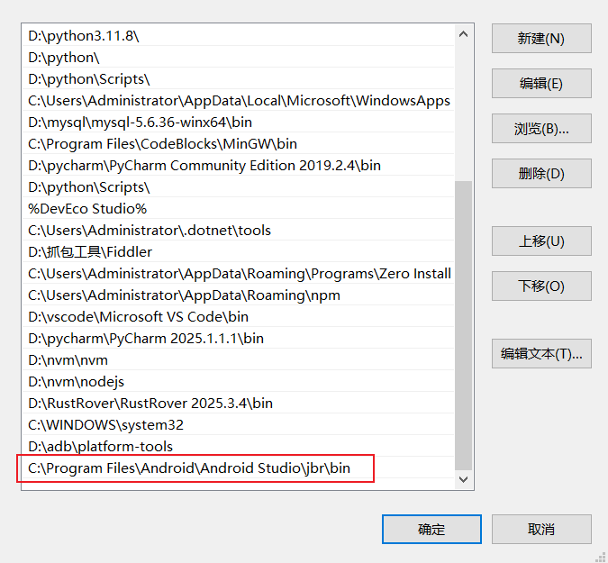

#### 生成密钥库**

使用 Java 的 `keytool` 命令生成一个 `.jks` 文件，在cmd或poweshell中的任意目录下执行都可以：

~~~cmd
keytool -genkey -v -keystore ~/upload-keystore.jks -keyalg RSA -keysize 2048 -validity 10000 -alias upload
~~~

秘钥库文件的生成路径可以自定义，只需要更改~/upload-keystore.jks这段路径即可

注意：

1. 一定要记住密钥库文件的具体的路径和生成密钥库时设置的密码，后续要用
2. 请务必将此密钥库文件存放在安全的地方，绝对不要提交到代码仓库！

#### 创建引用文件

在 `src-tauri/gen/android/` 目录下创建一个名为 `keystore.properties` 的文件，并填入以下内容：

~~~pro
storeFile=密钥库的绝对路径，建议使用双反斜杠
storePassword=你的密钥库密码
keyAlias=upload
keyPassword=你的密钥别名密码
~~~

示例：

~~~pro
storeFile=D:\\upload-keystore.jks
storePassword=qwerty
keyAlias=upload
keyPassword=qwerty
~~~

#### 配置 Gradle文件

编辑 `src-tauri/gen/android/app/build.gradle.kts` 文件：

在文件开头添加导入：

~~~txt
import java.io.FileInputStream
~~~

在 `android` 代码块前添加读取配置的代码：

~~~txt
val keystorePropertiesFile = rootProject.file("keystore.properties")
val keystoreProperties = Properties()
if (keystorePropertiesFile.exists()) {
    keystoreProperties.load(FileInputStream(keystorePropertiesFile))
}
~~~

在 `buildTypes` 代码块前添加签名配置:

~~~txt
signingConfigs {
    create("release") {
        keyAlias = keystoreProperties["keyAlias"] as String
        keyPassword = keystoreProperties["keyPassword"] as String
        storeFile = file(keystoreProperties["storeFile"] as String)
        storePassword = keystoreProperties["storePassword"] as String
    }
}
~~~

修改 `buildTypes` 中的 `release` 配置，引用上面的签名:

~~~txt
buildTypes {
    getByName("release") {
        signingConfig = signingConfigs.getByName("release")
        // ... 其他配置
    }
}
~~~

### 减少打包体积

Cargo.toml文件配置，显著减少体积，添加或修改`[profile.release]` 部分

~~~toml
[profile.release]
# 将代码生成单元数设为1，让LLVM进行更彻底的全局优化[reference:4]
codegen-units = 1
# 启用链接时优化（LTO），对整个程序进行整体优化[reference:5][reference:6]
lto = true
# 优化级别设为 's' 或 'z'，优先优化体积而非速度[reference:7][reference:8]
opt-level = "s"
# 使用 'abort' 策略处理panic，避免包含展开（unwind）代码，减小体积[reference:9][reference:10]
panic = "abort"
# 从最终二进制文件中剥离调试符号[reference:11][reference:12]
strip = true
# 增量编译可能会影响最终优化效果，在release配置中建议关闭[reference:13]
incremental = false
~~~

在 `src-tauri/tauri.conf.json` 文件中，找到 `"build"` 字段并添加以下字段，移除未使用的Tauri命令：

~~~json
{
  "build": {
    "removeUnusedCommands": true
  }
}
~~~

### 构建打包

构建APK文件，在项目根目录下执行：

~~~cmd
npm run tauri android build --apk
~~~

打包后的程序在项目目中的src-tauri/gen/android/app/build/outputs/apk文件夹中

## 安装app

###安装测试

1.手机开启开发者模式，打开USB调试功能，手机电脑使用数据线连接，手机选择传输文件模式

2.在电脑终端（如cmd）中执行：adb install app安装包绝对路径

3.安装软件，好处是在安装失败时，在终端中会输出错误信息，以便排查问题

4.也可以将安装包发送到手机上，手动安装

## 更新app

更新时，只需要增加版本号（比如0.0.1改为0.0.2），打包后安装时就能实现更新，原版本中的数据不会丢失，比如SQL插件创建的sqlite数据库及里面添加的数据也不会丢失.注意：将降本号降级后，打包后安装时会被系统拦截，使用adb命令强制降级安装后数据会被覆盖

## 清理缓存

清理Android缓存，在D:\TauriProject\health4\src-tauri\gen\android:

用于更改了rust代码或本地插件中的源码时

~~~cmd
gradlew clean
~~~

## 测试

### 连接手机

打开手机的开发者选项，开启USB调试或无限调试，使adb命令可以成功执行

注意：

+ 尝试了第三方模拟器（如雷电模拟器），执行测试命令时命令行信息会卡在某一个进度中，目前无法解决。
+ 尝试Android Studio中的模拟器时，虽然可以测试，但电脑配置低，模拟器太卡了
+ 使用物理真机，要求Android系统不能低于7.0，就算修改配置中的最低适配系统，也不行，不知道啥原因

### 执行测试

项目根目录执行：

~~~cmd
npm run tauri android dev
~~~

执行命令后，命令窗口会输出一堆信息，然后手机会提示需要安装此项目的app，名称默认就是创建项目时的名称，点击安装完会自动打开app，代表初步成功

### 开始调试

必须使用谷歌浏览器或Microsoft Edge浏览器

浏览器访问chrome://inspect地址，会打开一个页面，过会显示连接的手机，如果过会不显示，则使用Ctrl + c结束当前命令重新执行，多试几次

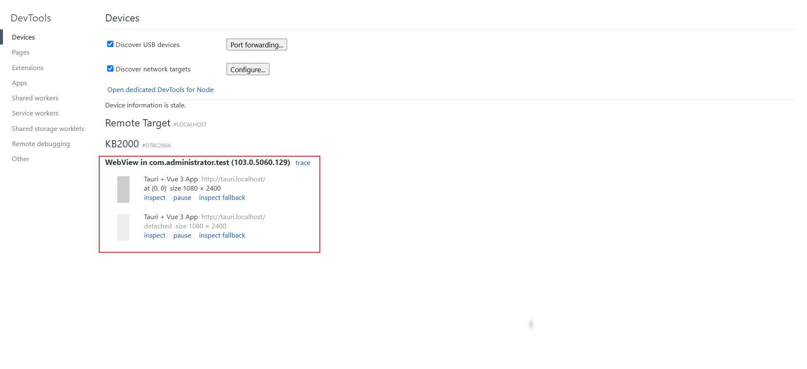

谷歌浏览器点击第一个设置中的inspect fallback，Microsoft Edge点击第一个设置中的inspect，打开调试工具

是与普通前端开发一致的调试页面，左半边是页面的实时内筒，右半边是调试工具

调试工具有时也会打不开或打开后没有左半边的页面。直接重新执行上述命令，重试

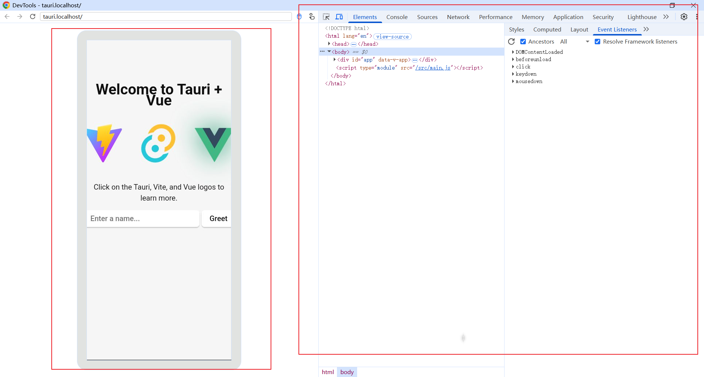

改动前端代码，页面会实时刷新，改动rust代码或配置文件，会重新编译

